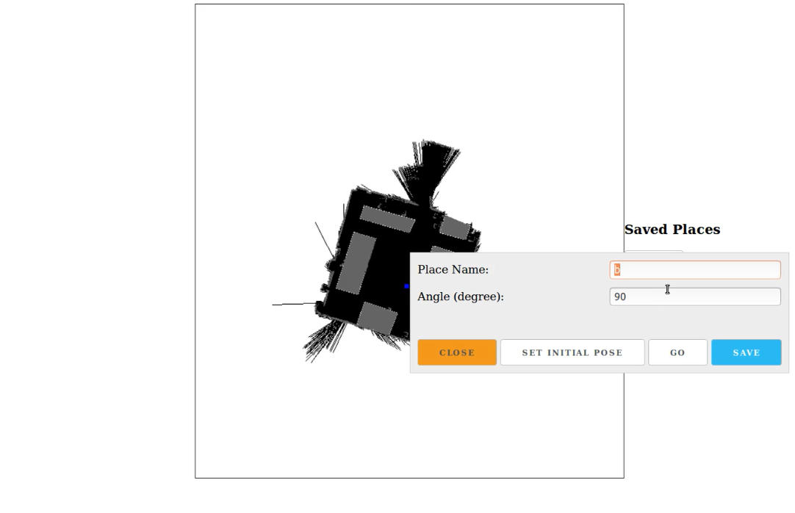
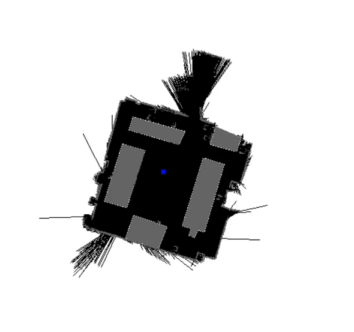

# <p align="center">University Of Bourgogne</p>


## <p align="center">Robotics Engineering</p>
---
<p align="center">

</p>

## <p align="center">Technical Report</p>

**<p align="center">Adem SAĞLAM</p>**

***

My project aims to demonstrate the implementation of ROS on a web application to serve as a base for the real world usage of a robot.


### Tools and Libraries
---
Entry to access ros features is done with rospy api. Which is a python library compatible with Python 2.7. For moving the robot it is using `SimpleActionClient` which is contained under `actionlib`. Other features of the application is done by subscribing and publishing to  topics.


For web access I built a simple entry point using Flask web framework. Which is compatible with Python 3+.
Web side is completely insulated from ros api to let me work on seperate parts without meeting dependency requirements. To realise this system I used Redis and made a pub/sub system that resembles ROS itself.


Third part of the system is the client side of the application which is responsible for the representation to the user. This side takes in the user input and realtime input from ros system like map and position of the robot. Communication from this layer to flask is done on web requests or websockets.


### User Interface
---

User interface is very straightforward with a map image and a popup window that opens when user clicks on anywhere of the image.

<p align="center">
  
</p>

User can give a direct move command by GO button or save this places into queue which can be later run and make the robot go to saved places one by one. Initially user should set the initial pose of the robot from here to match the physical location of the robot in the map.

### Application Flow
---

The application has two executables, `worker.py` which is in direct contact with rospy api through a class that I used in previous labs `MoveBase`. Other part `index.py` which should be run by `startsrv.sh` file, handles flask, socketio and redis.


`Worker` starts with fetching the map data and it's metadata `OccupancyGrid` and `MapMetaData`. `OccupancyGrid` contains the map data in its `data` field as `int8[]` type.
> The map data, in row-major order, starting with (0,0).  Occupancy
> \# probabilities are in the range [0,100].  Unknown is -1.

This data is used to generate a png image for presentation to the user. Ideally a user should be able select a place from the map to invoke a move command and the application should handle the rest. In this case a user input results in a coordination in pixels in image itself at best. But the `move_base` command requires a Pose which is a consisting of a Point and a Quaternion.

#### Excerpt from geometry_msgs/Point

> This contains the position of a point in free space\
> float64 x\
> float64 y\
> float64 z

#### Excerpt from geometry_msgs/Quaternion

> This represents an orientation in free space in quaternion form.\
> float64 x\
> float64 y\
> float64 z\
> float64 w


`MapMetaData` contains useful information to overcome this obstacle.

#### Excerpt from nav_msgs/MapMetaData

> This hold basic information about the characterists of the OccupancyGrid\
> time map_load_time # The time at which the map was loaded\
> float32 resolution # The map resolution [m/cell]\
> uint32 width # Map width [cells]\
> uint32 height # Map height [cells]\
> geometry_msgs/Pose origin #The origin of the map [m, m, rad].  This is the real-world pose of the cell (0,0) in the map.


We have width and height that is corresponding to the size of image in pixels, resolution is the scale which we can convert between pixels and points in map. Origin is another essential value which is a relative value that all the other points bound to. Conversion between degrees in radians to Quaternion doesn't require anything special from metadata.

With these valuable information we can now convert pixel coordinates to Points. 
```javascript
x = (pixelcoords.x - origin.x) * resolution;
y = (pixelcoords.y - origin.y) * resolution;
```

And vice-versa
```javascript
x = (origin.x - pixelcoords.x) / resolution;
y = (origin.y - pixelcoords.y) / resolution;
```

At this stage client side calculates Point and posts it to corresponding entry point of the Flask application. Routes at flask publishes the necessary information to matching redis channels to move and to set initial pose. All that is left to be done at `worker` is to convert radius angle to Quaternion and generate the action in rospy api.


After move and initial pose commands implemented the user experince was lacking responsiveness due to no feedback from ros except the map data. I decided to add a feature for finding the robot's actual position and marking it in the map realtime. This requires subscribing to `amcl_pose` topic from `worker`. `amcl_pose` topic receives `geometry_msgs/PoseWithCovarianceStamped` messages.

> std_msgs/Header header\
> geometry_msgs/PoseWithCovariance pose

This message contains pose with the actual position of the robot. Since the required procedure from pixel to point in map is already figured out, I used the reverse function described above to find the pixel coordinates of the robot in image.

<p align="center">
  
</p>


Web was born stateless but as the needs grow by time technologies like websockets came into picture. To reflect changes realtime on the web; I  used websockets and redraw scene every time a change occurs using a canvas. Location data flows into client side as follows: `worker` pushes `amcl_pose` data into a redis topic, this data then read by flask and get pushed again into a websocket. This data read by client side of the web and used to redraw scene with actual positioning of the robot.


One final feature of the application is chainable move commands. This behaviour needs the status of the last given command to move to the next command in line. To implement this an extra layer should be added for `GoalStatus` messages which contains following information.

> GoalID goal_id\
> uint8 status\
> uint8 PENDING = 0   # The goal has yet to be processed by the  action server\
> uint8 ACTIVE = 1   # The goal is currently being processed by the action server\
> uint8 PREEMPTED = 2   # The goal received a cancel request after it started executing and has since completed its execution (Terminal State)
> uint8 SUCCEEDED = 3   # The goal was achieved successfully by the action server (Terminal State)\
> uint8 ABORTED = 4   # The goal was aborted during execution by the action server due to some failure (Terminal State)\
> uint8 REJECTED = 5   # The goal was rejected by the action server without being processed, because the goal was unattainable or invalid (Terminal State)\
> uint8 PREEMPTING = 6   # The goal received a cancel request after it started executing and has not yet completed execution\
> uint8 RECALLING = 7   # The goal received a cancel request before it started executing, but the action server has not yet confirmed that the goal is canceled\
> uint8 RECALLED = 8   # The goal received a cancel request before it started executing and was successfully cancelled (Terminal State)\
> uint8 LOST = 9   # An action client can determine that a goal is LOST. This should not be sent over the wire by an action server\


When the user gives a move command, it is run by `actionlib` and this allows us to read the state of the move base command using get_state() method. Since there is no direct access to rospy from the web side, I had to use the same approach as the `amcl_pose` information and push the data into redis and websockets. With this method saved places list acts like a chain move command; application start with the first move command and waits until a `GoalStatus` command arrives through the websocket which carries the same place name and advances to next move command in queue.


With this project I demonstrated getting input and sending commands to ROS also while keeping a state of events. I moved from the idea of sending an indoor robot to place(s) that is configured on the known map. From a user perspective only requirement is a down to known map instead of hardcoded points.